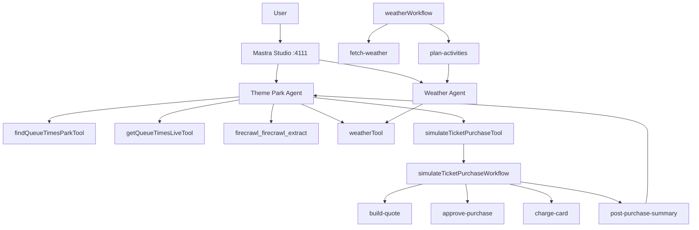

# Theme Park Agent — Walkthrough Guide

Complete scenarios for the two agents, their tools, and the ticket purchase workflow. Each scenario shows what to type in Mastra Studio (http://localhost:4111) and what you'll see back.

---

## Quick Start

```bash
npm run dev
```

Open **http://localhost:4111** → pick an agent from the sidebar.

> **Prerequisites:** `ZHIPU_API_KEY`, `ANTHROPIC_API_KEY`, and `FIRECRAWL_API_KEY` must be set in `.env`.

---

## Scenarios

### 1. Park Lookup & Live Wait Times

**Agent:** Theme Park Agent

**What it tests:** Park resolution via Queue-Times API → live ride data → sorted presentation.

| Step | You type | Agent does |
|---|---|---|
| 1 | `I want to visit Universal Studios Florida` | Calls `findQueueTimesParkTool` to resolve park ID |
| 2 | *(confirm when prompted)* | Stores park ID in memory |
| 3 | `What are the wait times right now?` | Calls `getQueueTimesLiveTool` with the stored park ID + timezone |
| 4 | — | Returns rides sorted by shortest wait first; closed rides listed last |

**Expected output shape:**

```
Here are the current wait times at Universal Studios Florida:

🟢 The Wizarding World of Harry Potter - Hagrid's Magical Creatures Motorbike Adventure  — 25 min
🟢 Hollywood Rip Ride Rock It  — 30 min
🟢 Revenge of the Mummy  — 35 min
...
🔴 Jurassic World VelociCoaster  — CLOSED
```

---

### 2. Weather-Aware Planning

**Agent:** Theme Park Agent

**What it tests:** Weather tool integration conditional on relevance (agent decides whether to call it).

| Step | You type | Agent does |
|---|---|---|
| 1 | `I want to visit Universal Studios Florida` | Resolves park (as above) |
| 2 | `Should I go tomorrow? It's supposed to rain` | Calls `weatherTool` with `"Orlando"` → factors conditions into advice |
| 3 | — | Suggests indoor alternatives if heavy rain, or best outdoor strategy if light |

**Why this is interesting:** The agent *chooses* whether to call `weatherTool`. If you just ask for wait times, it won't fetch weather. The instruction says only call it "if weather would clearly affect ride recommendations."

---

### 3. Deep Dive: Crowd Forecast & Historical Data

**Agent:** Theme Park Agent

**What it tests:** Firecrawl MCP scraping of queue-times.com pages for rich context beyond live data.

| Step | You type | Agent does |
|---|---|---|
| 1 | `I want to visit Islands of Adventure on May 15th` | Resolves park ID |
| 2 | `How crowded will it be? What's the historical data like?` | Calls `firecrawl_firecrawl_extract` on `/parks/{id}/calendar` for crowd forecast AND `/parks/{id}/stats` for busy-day patterns |
| 3 | — | Presents crowd level prediction + historical attendance trends |

**Tools used:** `findQueueTimesParkTool` → `firecrawl_firecrawl_extract` (2 calls)

---

### 4. Multi-Turn Conversation with Memory

**Agent:** Theme Park Agent

**What it tests:** Memory persistence — park ID carries across turns without re-lookup.

| Step | You type | Agent does |
|---|---|---|
| 1 | `I'm planning a day at Epcot` | Looks up park, confirms ID |
| 2 | `Wait times please` | Fetches live waits (uses cached park ID) |
| 3 | `Is Test Track open?` | Checks result from previous call — no re-lookup needed |
| 4 | `Actually switch me to Magic Kingdom` | Looks up new park, replaces cached ID |
| 5 | `Wait times now?` | Fetches for Magic Kingdom (new cached ID) |

**Key behavior:** Steps 2–3 use the park ID resolved in step 1. Step 4 resets it. This is handled by the agent's `Memory` instance.

---

### 5. Weather Workflow (Standalone)

**Run via:** Studio → Workflows tab → `weatherWorkflow` → Run

**What it tests:** Two-step workflow — fetch weather → stream activity suggestions from weather agent.

**Input:**

```json
{ "city": "Orlando" }
```

**Execution flow:**

```
Step 1: fetch-weather
  → Geocodes "Orlando" via Open-Meteo
  → Fetches hourly forecast (temp, precipitation, weather code)
  → Returns structured forecast object

Step 2: plan-activities
  → Gets weatherAgent from Mastra instance
  → Streams a detailed activity plan to terminal (live)
  → Returns activities text as workflow output
```

**Terminal output during step 2:**

```
📅 Saturday, April 26, 2026
═══════════════════════════

🌡️ WEATHER SUMMARY
• Conditions: Partly cloudy
• Temperature: 22°C/72°F to 31°C/88°F
• Precipitation: 15% chance

🌅 MORNING ACTIVITIES
Outdoor:
• Morning jog at Lake Eola Park - Flat 1.2 mile loop around the lake
  Best timing: 7:00 AM - 8:30 AM
  Note: Low humidity, comfortable start

...[streams live until complete]
```

---

### 6. Ticket Purchase — Full In-Chat Flow

**Agent:** Theme Park Agent

**What it tests:** Complete 4-step workflow triggered from agent chat: build quote → suspend → approve/deny → charge → visit brief.

#### 6a. Approve Path

| Step | You type | What happens under the hood |
|---|---|---|
| 1 | `Buy 2 tickets for Universal Studios Florida on 2026-05-15` | Agent calls `simulateTicketPurchaseTool` → workflow starts → `build-quote` calculates $234.30 → `approve-purchase` **suspends** |
| 2 | — | Tool returns `{ status: "suspended", quote: {...}, runId: "abc123" }` |
| 3 | — | Agent presents quote and asks: *Approve or deny?* |
| 4 | `yes` | Agent calls tool again with `{ runId: "abc123", approved: true }` → workflow resumes → `chargeCard` charges card → `postPurchaseSummary` streams visit brief |
| 5 | — | Agent presents confirmation + full 3-point brief |

**Terminal output during step 4 (inside `postPurchaseSummary`):**

```
🎫 Purchase confirmed! Generating your visit brief for Universal Studios Florida on 2026-05-15...

Best arrival time: Arrive at rope drop (park opening). Why: You'll get first access to popular rides before queues build.
Must-do in first 30 minutes: Head straight to Hagrid's Motorbike Adventure — lines hit 90+ min within an hour of opening.
Watch out for: Midday crowds around the Wizarding World area — plan that section for after 3 PM when lines thin out.
```

**Final agent response includes:**

- Confirmation ID
- Card brand / last 4
- Total charged
- Full visit brief (arrival tip, must-do attraction, thing to avoid)

#### 6b. Deny Path

| Step | You type | What happens |
|---|---|---|
| 1 | `Buy 2 tickets for Universal Studios Florida on 2026-05-15` | Same suspend as above |
| 2 | — | Quote presented, ~$234.30 |
| 3 | `no thanks` or `deny` | Agent calls tool with `{ runId: "...", approved: false }` → workflow resumes → `bail()` returns cancelled status |
| 4 | — | Agent confirms cancellation |

**No charge. No brief. Clean cancellation.**

---

### 7. Ticket Purchase — Via Studio Workflow Runner

**Run via:** Studio → Workflows tab → `simulateTicketPurchaseWorkflow` → Run

**What it tests:** Direct workflow execution without going through the agent. Useful for debugging the workflow in isolation.

**Input:**

```json
{
  "parkName": "Universal Studios Florida",
  "date": "2026-05-15",
  "quantity": 2,
  "unitPriceUsd": 110
}
```

**Flow:**

1. Studio runs `build-quote` → shows quote output
2. Workflow suspends at `approve-purchase` → Studio shows suspend payload
3. Click **Resume** → enter `{ "approved": true }`
4. `chargeCard` executes (2s simulated delay)
5. `postPurchaseSummary` streams brief to terminal
6. Workflow completes with full result including `visitBrief`

This is the same flow as scenario 6 but driven through Studio's UI instead of the agent.

---

### 8. Weather Agent (Direct)

**Agent:** Weather Agent

**What it tests:** Standalone weather agent with scorers — simpler than the theme park agent, good for testing basic agent/tool interaction.

| Step | You type | Agent does |
|---|---|---|
| 1 | `What's the weather in Tokyo?` | Calls `weatherTool` with `"Tokyo"` → returns current conditions + humidity/wind/precipitation |
| 2 | `What should I do today there?` | Uses weather context to suggest activities |
| 3 | `How about Paris?` | Switches location, fetches new data |

**Scorers running in background:** Every response is scored on tool-call appropriateness, completeness, and translation quality (sampling rate 100% — every call is evaluated).

---

## Architecture Reference

### Component Map



### Workflow Step Details

#### `simulateTicketPurchaseWorkflow` — 4 steps

| Step | ID | Input | Output | Side effects |
|---|---|---|---|---|
| 1 | `build-quote` | date, quantity, unitPriceUsd | parkName, date, quantity, prices | Pure calculation |
| 2 | `approve-purchase` | quote | status, note, quote | Suspends on first pass; resumes with `{ approved }` |
| 3 | `charge-card` | resultSchema | resultSchema + confirmationId, card | Calls `mockChargeTool` (2s delay) |
| 4 | `post-purchase-summary` | resultSchema | resultSchema + visitBrief | Streams `themeParkAgent` via `agent.stream()` + `textStream.tee()` |

#### `weatherWorkflow` — 2 steps

| Step | ID | Input | Output | Side effects |
|---|---|---|---|---|
| 1 | `fetch-weather` | city | forecast (temp, condition, precip) | Fetches Open-Meteo API |
| 2 | `plan-activities` | forecast | activities text | Streams `weatherAgent` to terminal |

### Tool I/O Summary

| Tool | Key input | Key output | External dependency |
|---|---|---|---|
| `findQueueTimesParkTool` | park name string | park ID, name, timezone | queue-times.com API |
| `getQueueTimesLiveTool` | park ID, timezone | sorted ride list with waits | queue-times.com API |
| `firecrawl_firecrawl_extract` | URL + schema | scraped page content | Firecrawl MCP server |
| `weatherTool` | city name | temp, condition, humidity, wind | Open-Meteo API |
| `mockChargeTool` | amount USD | paymentIntentId, card mock | None (deterministic) |
| `simulateTicketPurchaseTool` | parkName, date, qty ± runId/approved | quote OR final result ± visitBrief | Internal workflow |

---

## Troubleshooting

| Symptom | Likely cause | Fix |
|---|---|---|
| Agent can't find park | Typo in park name or park not in Queue-Times DB | Try exact name from queue-times.com |
| Firecrawl returns empty | Missing `FIRECRAWL_API_KEY` in `.env` | Copy `.env.example` to `.env`, add key |
| Workflow hangs at approve-purchase | Expected — it's suspended waiting for resume | Send approval/denial via agent or Studio |
| `visitBrief` missing from result | Purchase wasn't confirmed (cancelled or not yet resumed) | Confirm the approve path completed |
| Build fails with Zod errors | Harmless Zod v3/v4 mismatch in `node_modules/@mastra/core` | Ignore — these are internal type errors |
